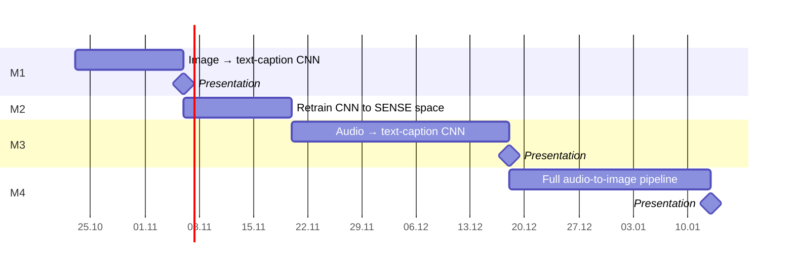

## Timeline


```mermaid
gantt
    dateFormat YYYY-MM-DD
    axisFormat %d.%m

    section M1
    Image → text-caption CNN                  :m1, 2026-10-23, 2026-11-06
    Presentation                              :milestone, 2026-11-06, 0d

    section M2
    Retrain CNN to SENSE space                :m2, 2026-11-06, 2026-11-20

    section M3
    Audio → text-caption CNN                  :m3, 2026-11-20, 2026-12-18
    Presentation                              :milestone, 2026-12-18, 0d

    section M4
    Full audio-to-image pipeline              :m4, 2026-12-18, 2027-01-13
    Presentation                              :milestone, 2027-01-13, 0d
```

## Setup

```shell
python3 -m venv .venv
source .venv/bin/activate
pip install -r requirements.txt
```

## Run

```shell
source .venv/bin/activate
python3 whatever.py
```
